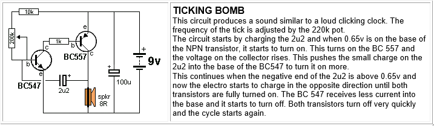
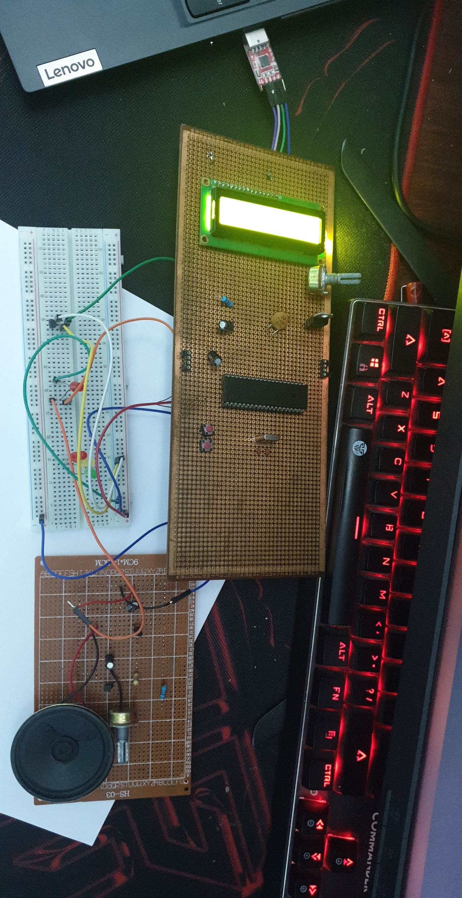

# Microcontrollers-BasicCircuitProject-HeatAlarm

<pre>
  • Basic Hardware Project - Heating Alarm - Microcontrollers & Electronics Circuit.
  This is a basic circuit that prints a name on the LCD then by using a temperature sensor it keeps checking if the temperature is below 28 °Celsius.
  If the temperature > 28 °Celsius, A buzzer will start the alarming, and a warning will be sent to the PC by a Serial Communication FTDI.
  Using:    
    Software: 
    PICSimLab V.7.5 (PIC18F4620).
    MPLAB X IDE V.5.35 with XC8 Compiler.
    Bootloader.
    Tera Term VT for  Serial Communication with FTDI.
    
    Hardware:
    4MHz Crtystal
    USB TTL Serial Cables - FTDI (CP2102 Modules)
    Variable resistor
    PIC18F4620 - Microchip
    Capacitors
    LCD
    LEDs
    Breadboard
    Ticking bomb electronic circuit (Description in the Picture).
    
</pre>

